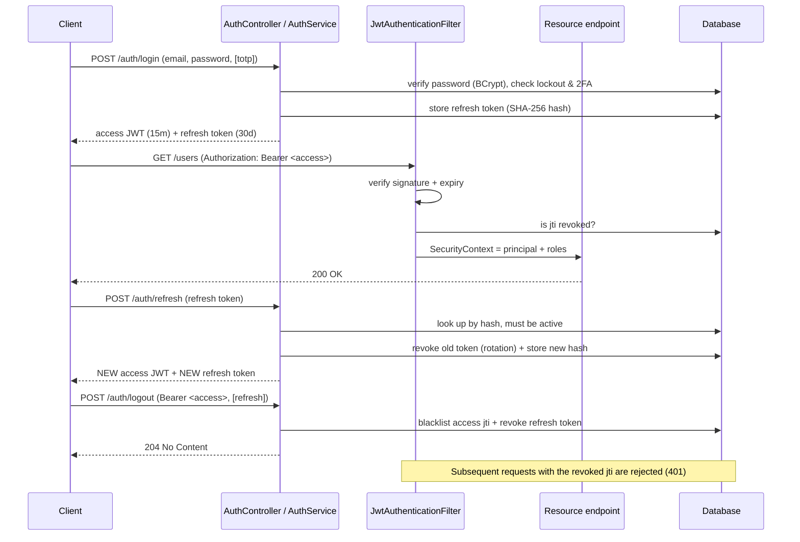

# IAM Service

A production-grade **Identity & Access Management** microservice built with Spring Boot 3.4 and Java 21.
It provides user registration & authentication with **JWT access tokens and rotating refresh tokens**,
**role- and group-based authorization**, **TOTP two-factor authentication**, **multi-tenancy**, and a
**security audit log** — secured statelessly by a JWT servlet filter.

> This is an original, clean-room portfolio project. It contains no proprietary code and no real secrets.

---

## Features

- **Authentication** — email/password login with BCrypt password hashing.
- **JWT access tokens** — short-lived, HMAC-signed (HS256), carrying `sub`, `email`, `tenantId`, `roles` and a unique `jti`.
- **Rotating refresh tokens** — long-lived, **stored only as SHA-256 hashes**; every refresh revokes the presented token and issues a new one (rotation prevents replay).
- **Token revocation** — logout blacklists the access token by `jti` and revokes refresh tokens; a scheduler purges expired entries.
- **Two-factor authentication (2FA)** — TOTP (RFC 6238), compatible with Google Authenticator / Authy, with QR-code provisioning.
- **Authorization** — roles and tenant-scoped groups (groups grant roles); method-level `@PreAuthorize` guards.
- **Multi-tenancy** — users are unique per `(email, tenant)`; tenant is carried in the token and a request-scoped `TenantContext`.
- **Account protection** — configurable failed-login lockout.
- **Audit log** — security events persisted with structured JSON detail (`jsonb`).
- **RFC-7807 errors** — consistent `application/problem+json` responses with distinct problem types.
- **OpenAPI / Swagger UI** — with a JWT "Authorize" button.
- **Flyway** migrations, **Testcontainers** integration tests, **Docker** & **docker-compose**, **GitHub Actions** CI.

## Tech stack

| Area | Choice |
|------|--------|
| Language / runtime | Java 21 |
| Framework | Spring Boot 3.4.3 (Web, Security, Data JPA, Validation, Actuator) |
| JWT | `com.auth0:java-jwt` |
| 2FA | `dev.samstevens.totp` |
| Database | PostgreSQL 17 + Flyway migrations |
| Docs | springdoc-openapi (Swagger UI) |
| Build | Gradle 8.13 (Spring Dependency Management BOM) |
| Tests | JUnit 5, Mockito, AssertJ, Testcontainers |

---

## Authentication flow



## Security model

- **Stateless sessions** — no server session; every request is authenticated from the bearer token (`SessionCreationPolicy.STATELESS`).
- **Roles & groups** — a `User` holds roles directly and via `Group`s (a group grants a set of roles). Roles become Spring Security authorities (`ROLE_ADMIN`, `ROLE_USER`) and drive `@PreAuthorize("hasRole('ADMIN')")`.
- **Multi-tenancy** — the tenant is embedded in the JWT and resolved into a request-scoped `TenantContext` (also settable via the `X-Tenant-Id` header for public endpoints). All identity lookups are tenant-scoped, and `(email, tenant_id)` is unique.
- **Refresh-token rotation** — refresh tokens are single-use: each refresh revokes the old token and issues a new one, so a stolen-and-reused token is detected/rejected.
- **Hashed refresh tokens** — only a SHA-256 hash is stored; a database leak yields no usable tokens.
- **Access-token revocation** — logout records the token's `jti` in a blacklist; the filter rejects blacklisted tokens until they expire, after which a scheduler purges them.
- **Account lockout** — consecutive failed logins increment a counter; exceeding the threshold locks the account and revokes its refresh tokens.
- **2FA** — when enabled, login requires a valid TOTP code in addition to the password.
- **Password storage** — BCrypt (adaptive, salted) via Spring Security.

---

## Running locally

### With Docker Compose (recommended)

```bash
docker compose up --build
```

This starts PostgreSQL and the service (profiles `docker,seed`). With seeding enabled a demo admin is created:

- email: `admin@example.com`
- password: `ChangeMe123!`  *(demo only — change it)*

Then open Swagger UI: <http://localhost:8080/swagger-ui.html>

Optional DB UI (Adminer on :8081):

```bash
docker compose --profile tools up
```

### Without Docker

Requires a local PostgreSQL and JDK 21:

```bash
export JWT_SECRET="a-long-random-secret-at-least-32-bytes-please"
export DB_URL="jdbc:postgresql://localhost:5432/iam"
./gradlew bootRun
```

---

## API

Base path: `/api/v1`. All protected endpoints expect `Authorization: Bearer <access token>`.
Admin endpoints require `ROLE_ADMIN`.

| Method | Path | Auth | Description |
|--------|------|------|-------------|
| POST | `/auth/register` | public | Register a user (assigns `ROLE_USER`) |
| POST | `/auth/login` | public | Log in; returns access + refresh tokens |
| POST | `/auth/refresh` | public | Rotate refresh token, get a new pair |
| POST | `/auth/logout` | bearer | Revoke access token (+ optional refresh) |
| GET | `/auth/me` | bearer | Current user profile |
| GET | `/users` | admin | List users (paginated) |
| POST | `/users` | admin | Create a user |
| GET | `/users/{id}` | admin | Get a user |
| PATCH | `/users/{id}` | admin | Update a user |
| DELETE | `/users/{id}` | admin | Delete a user |
| POST | `/users/{id}/roles` | admin | Assign roles |
| DELETE | `/users/{id}/roles/{role}` | admin | Revoke a role |
| POST | `/users/{id}/groups` | admin | Assign groups |
| PUT | `/users/{id}/lock` \| `/unlock` | admin | Lock / unlock |
| POST | `/users/me/password` | bearer | Change your own password |
| GET \| POST \| DELETE | `/roles` | admin | Role catalog |
| GET \| POST \| PUT \| DELETE | `/groups` | admin | Tenant groups |
| POST | `/2fa/setup` \| `/enable` \| `/disable` | bearer | 2FA lifecycle |
| GET | `/audit` | admin | Query audit events (paginated) |

### Example: register

```bash
curl -sX POST http://localhost:8080/api/v1/auth/register \
  -H 'Content-Type: application/json' \
  -H 'X-Tenant-Id: primary' \
  -d '{"email":"alice@example.com","password":"password123","fullName":"Alice"}'
```

### Example: login

```bash
curl -sX POST http://localhost:8080/api/v1/auth/login \
  -H 'Content-Type: application/json' \
  -d '{"email":"alice@example.com","password":"password123"}'
# => { "accessToken":"...", "refreshToken":"...", "tokenType":"Bearer", "expiresIn":900 }
```

### Example: call a protected endpoint

```bash
curl -s http://localhost:8080/api/v1/auth/me \
  -H "Authorization: Bearer $ACCESS_TOKEN"
```

### Example: refresh (rotation)

```bash
curl -sX POST http://localhost:8080/api/v1/auth/refresh \
  -H 'Content-Type: application/json' \
  -d '{"refreshToken":"'"$REFRESH_TOKEN"'"}'
```

### Example: enable 2FA

```bash
# 1) start setup -> returns { secret, otpauthUri, qrCodeDataUri }
curl -sX POST http://localhost:8080/api/v1/2fa/setup \
  -H "Authorization: Bearer $ACCESS_TOKEN"

# 2) confirm with a code from your authenticator app
curl -sX POST http://localhost:8080/api/v1/2fa/enable \
  -H "Authorization: Bearer $ACCESS_TOKEN" \
  -H 'Content-Type: application/json' \
  -d '{"totpCode":"123456"}'
```

> **Refresh token delivery — cookie option.** For browser clients the refresh token can be delivered as an
> `HttpOnly; Secure; SameSite=Strict` cookie instead of the JSON body, keeping it out of reach of JavaScript.
> This service returns it in the body for simplicity; switching to a cookie only affects `/login` and `/refresh`.

---

## Configuration

| Env var | Property | Default | Notes |
|---------|----------|---------|-------|
| `JWT_SECRET` | `app.security.jwt.secret` | *(dev default)* | **Set in every real environment.** ≥ 32 bytes for HS256 |
| `ACCESS_TOKEN_TTL` | `app.security.jwt.access-token-ttl` | `900` | Access token lifetime (seconds) |
| `REFRESH_TOKEN_TTL` | `app.security.jwt.refresh-token-ttl` | `2592000` | Refresh token lifetime (seconds) |
| `MAX_FAILED_ATTEMPTS` | `app.security.lockout.max-failed-attempts` | `5` | Lock account after N failed logins |
| `DB_URL` | `spring.datasource.url` | local Postgres | JDBC URL |
| `DB_USERNAME` / `DB_PASSWORD` | `spring.datasource.*` | `iam` / `iam` | DB credentials |
| `SEED_ENABLED` | `app.seed.enabled` | `false` | Seed demo admin (with `seed`/`dev` profile) |
| `SEED_ADMIN_EMAIL` / `SEED_ADMIN_PASSWORD` | `app.seed.*` | demo values | **Demo only — never real secrets** |

---

## Project structure

```
src/main/java/com/portfolio/iam
├── IamServiceApplication.java
├── config/         # OpenAPI, JPA auditing, typed properties, dev DataSeeder
├── controller/     # Auth, User, Role, Group, TwoFactor, Audit REST controllers
├── domain/entity/  # User, Role, Group, RefreshToken, RevokedAccessToken, AuditEvent
├── dto/            # request/response records
├── repository/     # Spring Data JPA repositories
├── security/       # JwtService, JwtAuthenticationFilter, SecurityConfig, TenantContext
├── service/        # Auth, User, Role, Group, TwoFactor, Audit, TokenCleanupScheduler
└── web/            # GlobalExceptionHandler (RFC-7807) + exceptions
src/main/resources
├── application.yml, application-docker.yml
└── db/migration/   # Flyway V1__init.sql, V2__seed_roles.sql
src/test/java             # unit tests (JUnit 5 + Mockito, no Spring/DB)
src/integrationTest/java  # Testcontainers + @SpringBootTest end-to-end tests
```

---

## Testing

**Unit tests** (fast, no Spring context or database):

```bash
./gradlew test
```

Covers JWT round-trip/expiry/tamper detection, login + lockout + 2FA paths, refresh-token rotation,
2FA verification, and user administration.

**Integration tests** (Testcontainers PostgreSQL + full app, requires Docker):

```bash
./gradlew integrationTest
```

`AuthFlowIT` exercises register → login → protected call → refresh (rotation) → logout → token rejected.
`TwoFactorFlowIT` exercises the full 2FA enablement and login flow. The `integrationTest` task is a separate
source set and is intentionally **not** part of `build`/`check`, so CI without Docker still passes.

---

## License

[MIT](LICENSE) © 2026 IAM Service contributors
